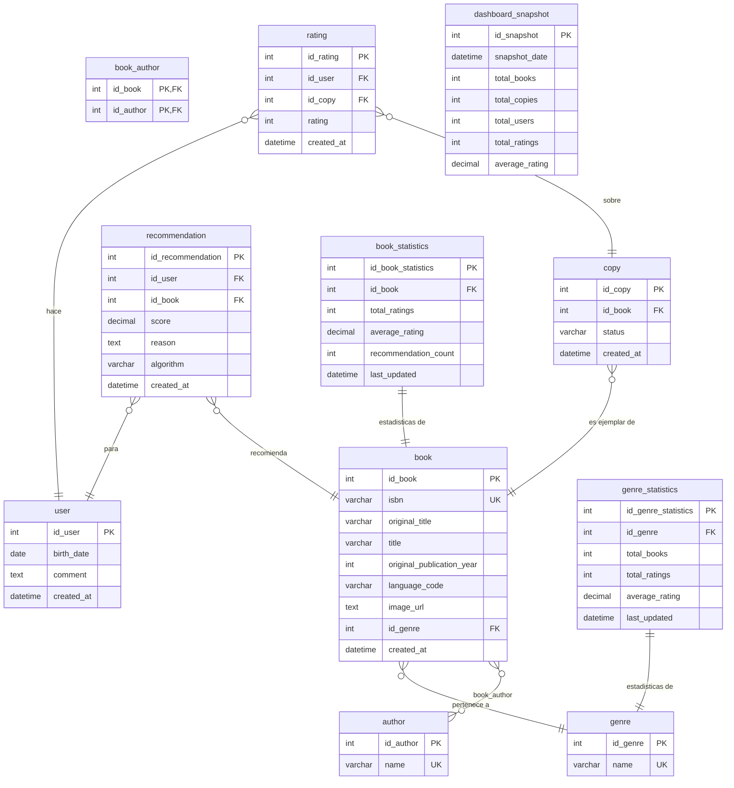

# Esquema de la base de datos — Casa de la Cultura

> Última actualización: 10/05/2026
> Basado en el diseño de Juan Gabriel Carvajal, incorporando las decisiones previas del equipo y las restricciones físicas previstas para la implementación en SQLite.

---

## Decisiones de diseño

- `isbn`, `title` y `original_publication_year` son NOT NULL — los registros sin estos campos se descartan según indicación expresa del cliente.
- `isbn` se define como UNIQUE para evitar duplicidades en el catálogo bibliográfico. Esta restricción deberá validarse durante la carga de datos para comprobar que el dataset no contiene ISBN duplicados.
- `author` tiene tabla propia con relación N:M a `book` a través de `book_author` — más normalizado que un campo de texto plano.
- `author.name` se define como NOT NULL y UNIQUE para evitar duplicidad de autores.
- `sexo` eliminado de `user` — indicación expresa del cliente y principio de minimización GDPR.
- `comment` se conserva en `user` como campo de preferencias para el motor de recomendación.
- `rating` tiene CHECK entre 1 y 5.
- `rating` incluye una restricción UNIQUE sobre `id_user` e `id_copy`, para evitar que un mismo usuario valore más de una vez el mismo ejemplar.
- `genre` tiene tabla propia. El valor inicial de cada libro será NULL hasta que se implemente la clasificación automática, autorizado por el cliente.
- `genre.name` se define como NOT NULL y UNIQUE para evitar géneros duplicados.
- `copy` incluye campo `status` para gestionar la disponibilidad de cada ejemplar.
- `recommendation` almacena las recomendaciones generadas por el motor con su puntuación, explicación y algoritmo usado.
- `recommendation` incluye una restricción UNIQUE sobre `id_user` e `id_book`, para evitar recomendaciones duplicadas del mismo libro a un mismo usuario.
- `book_statistics` y `genre_statistics` precalculan métricas para los dashboards y evitan consultas pesadas en tiempo real.
- `dashboard_snapshot` guarda instantáneas globales del sistema para histórico de uso.
- Las claves foráneas incorporan reglas de integridad referencial mediante `ON UPDATE CASCADE`, `ON DELETE CASCADE` y `ON DELETE SET NULL`, según el tipo de relación.
- Esta documentación representa el diseño lógico y justificativo de la base de datos. La implementación física se concreta mediante la query SQLite correspondiente.

---

## Diagrama ER

---

## Restricciones importantes

- `book.isbn` es NOT NULL para garantizar que todos los libros cargados tengan identificador bibliográfico.
- `book.isbn` es UNIQUE para evitar duplicidades en el catálogo.
- `book.title` es NOT NULL para garantizar que todos los libros tengan título.
- `book.original_publication_year` es NOT NULL para asegurar que todos los registros tengan año de publicación.
- `author.name` es NOT NULL para evitar autores sin nombre.
- `author.name` es UNIQUE para evitar duplicidad de autores.
- `genre.name` es NOT NULL para evitar géneros sin nombre.
- `genre.name` es UNIQUE para evitar géneros duplicados.
- `rating.rating` tiene una restricción CHECK entre 1 y 5 para garantizar que todas las valoraciones estén dentro del rango permitido.
- `rating` incluye una restricción UNIQUE sobre `id_user` e `id_copy` para evitar que un mismo usuario valore más de una vez el mismo ejemplar.
- `recommendation` incluye una restricción UNIQUE sobre `id_user` e `id_book` para evitar recomendaciones duplicadas del mismo libro a un mismo usuario.
- `book_author` utiliza una clave primaria compuesta por `id_book` e `id_author` para representar correctamente la relación muchos a muchos entre libros y autores.

---

## Índices previstos

- Se crea un índice sobre `book.id_genre` para optimizar los filtros y consultas por género.
- Se crea un índice sobre `book.title` para mejorar las búsquedas frecuentes por título dentro del catálogo.
- Se crea un índice sobre `book.isbn` para agilizar las búsquedas exactas por identificador bibliográfico.
- Se crea un índice sobre `copy.id_book` para optimizar las uniones frecuentes entre ejemplares y libros.
- Se crea un índice sobre `rating.id_user` para acelerar las consultas de valoraciones realizadas por un usuario.
- Se crea un índice sobre `rating.id_copy` para mejorar las uniones entre valoraciones y ejemplares.
- Se crea un índice sobre `recommendation.id_user` para obtener rápidamente las recomendaciones asociadas a un usuario.
- Se crea un índice sobre `recommendation.id_book` para consultar de forma eficiente los libros recomendados.
- Se crea un índice sobre `book_statistics.id_book` para acceder rápidamente a las métricas precalculadas de cada libro.
- Se crea un índice sobre `genre_statistics.id_genre` para consultar de forma rápida las métricas precalculadas por género.

---

## Políticas de integridad referencial

- La relación entre `book` y `genre` utiliza `ON DELETE SET NULL`, de forma que si se elimina un género, los libros asociados no se eliminan, sino que quedan temporalmente sin clasificación.
- La relación entre `book_author` y `book` utiliza `ON DELETE CASCADE`, de forma que si se elimina un libro, se eliminan también sus relaciones con autores.
- La relación entre `book_author` y `author` utiliza `ON DELETE CASCADE`, de forma que si se elimina un autor, se eliminan también sus relaciones con libros.
- La relación entre `copy` y `book` utiliza `ON DELETE CASCADE`, de forma que si se elimina un libro, se eliminan también sus ejemplares asociados.
- La relación entre `rating` y `user` utiliza `ON DELETE CASCADE`, de forma que si se elimina un usuario, se eliminan también sus valoraciones.
- La relación entre `rating` y `copy` utiliza `ON DELETE CASCADE`, de forma que si se elimina un ejemplar, se eliminan también sus valoraciones asociadas.
- La relación entre `recommendation` y `user` utiliza `ON DELETE CASCADE`, de forma que si se elimina un usuario, se eliminan también sus recomendaciones.
- La relación entre `recommendation` y `book` utiliza `ON DELETE CASCADE`, de forma que si se elimina un libro, se eliminan también las recomendaciones asociadas a ese libro.
- La relación entre `book_statistics` y `book` utiliza `ON DELETE CASCADE`, de forma que si se elimina un libro, se eliminan también sus métricas precalculadas.
- La relación entre `genre_statistics` y `genre` utiliza `ON DELETE CASCADE`, de forma que si se elimina un género, se eliminan también sus métricas precalculadas.
- Todas las claves foráneas utilizan `ON UPDATE CASCADE` para mantener la coherencia de las relaciones si se modifica algún identificador primario.
