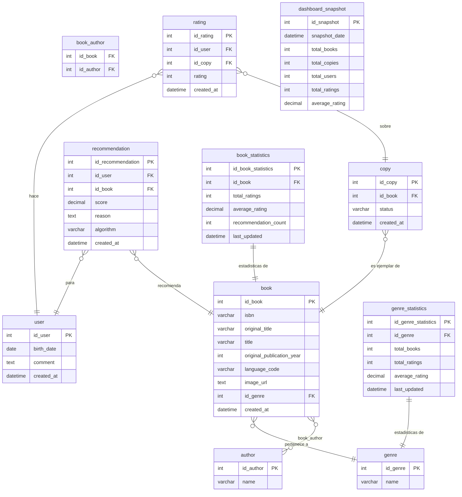

# Esquema de la base de datos — Casa de la Cultura

> Última actualización: 10/05/2026
> Basado en el diseño de Juan Gabriel Carvajal, incorporando las decisiones previas del equipo.

---

## Decisiones de diseño

- `isbn`, `title` y `original_publication_year` son NOT NULL — los registros sin estos campos se descartan según indicación expresa del cliente.
- `author` tiene tabla propia con relación N:M a `book` a través de `book_author` — más normalizado que un campo de texto plano.
- `sexo` eliminado de `user` — indicación expresa del cliente y principio de minimización GDPR.
- `comment` se conserva en `user` como campo de preferencias para el motor de recomendación.
- `rating` tiene CHECK entre 1 y 5.
- `genre` tiene tabla propia. El valor inicial de cada libro será NULL hasta que se implemente la clasificación automática (autorizado por el cliente).
- `copy` incluye campo `status` para gestionar la disponibilidad de cada ejemplar.
- `recommendation` almacena las recomendaciones generadas por el motor con su puntuación y el algoritmo usado.
- `book_statistics` y `genre_statistics` precalculan métricas para los dashboards y evitan consultas pesadas en tiempo real.
- `dashboard_snapshot` guarda instantáneas globales del sistema para histórico de uso.

---

## Diagrama ER

---

## Restricciones importantes

| Tabla | Campo | Restricción |
|-------|-------|-------------|
| book | isbn | NOT NULL |
| book | title | NOT NULL |
| book | original_publication_year | NOT NULL |
| rating | rating | CHECK entre 1 y 5 |
| book_author | id_book + id_author | PK compuesta |

---

## Índices previstos

| Tabla | Campo | Motivo |
|-------|-------|--------|
| copy | id_book | Joins frecuentes con book |
| rating | id_copy | Joins frecuentes con copy |
| rating | id_user | Filtrado por usuario |
| book | id_genre | Filtrado por género |
| book_statistics | id_book | Lookup rápido de métricas |
| genre_statistics | id_genre | Lookup rápido de métricas |
