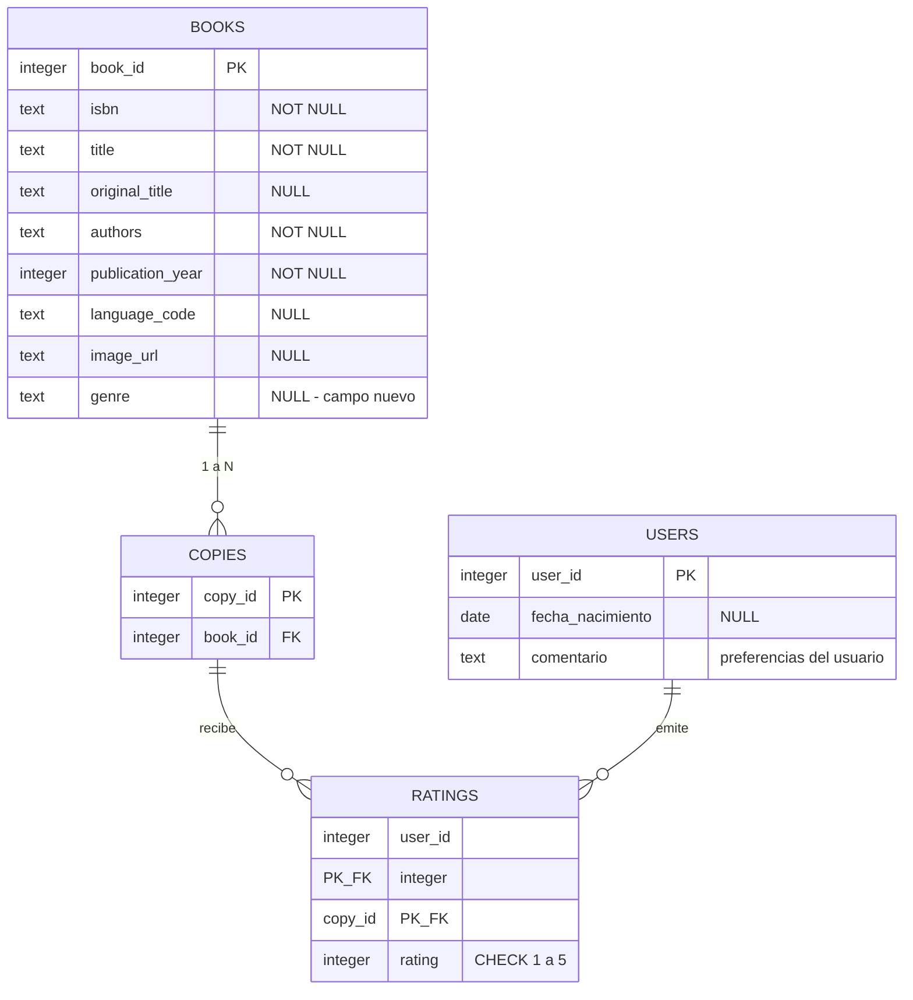

# Esquema de la base de datos

Diseño del modelo de datos definitivo a partir de los archivos del sistema anterior.
Las decisiones de depuración siguen el criterio del cliente: se descartan los registros
de libros sin ISBN, sin autor o sin fecha de publicación. El campo `sexo` de usuarios
se elimina por indicación expresa del cliente. Se añade el campo `genre` en libros,
autorizado por el cliente, con valor NULL inicial.

## Diagrama entidad-relación

## Índices previstos

- `copies(book_id)` — para hacer JOIN entre ratings y books vía copies
- `ratings(copy_id)` — la PK compuesta empieza por user_id, así que copy_id solo necesita índice propio
- `books(genre)` — para filtros en los dashboards cuando el campo esté relleno

## Decisiones pendientes

- Origen del campo `genre`: a definir con el equipo. Opciones: aportado por el cliente,
  enriquecido desde fuente externa (Open Library), o inferido automáticamente.
